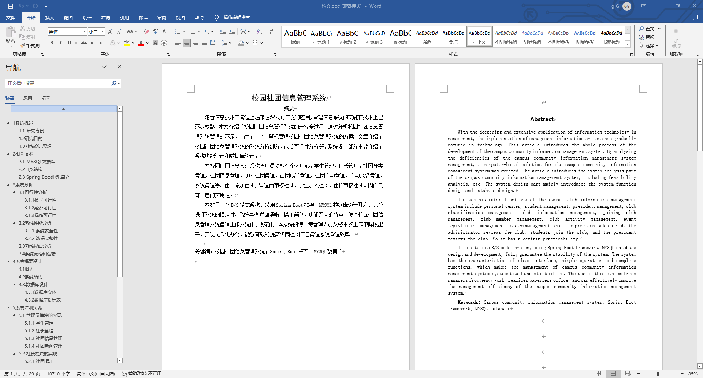
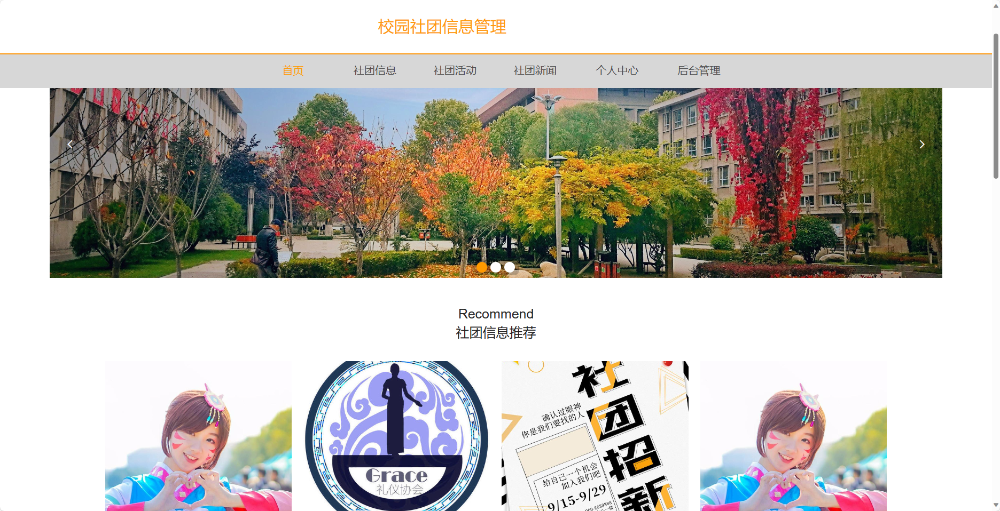
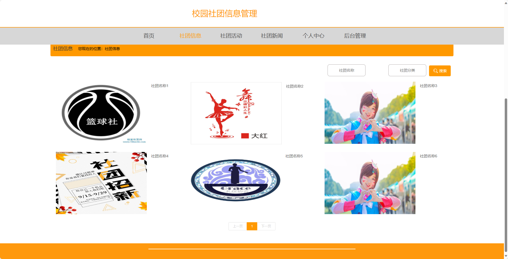
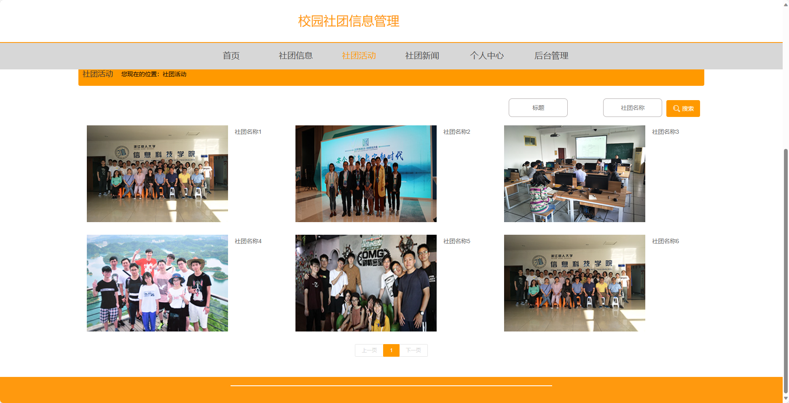
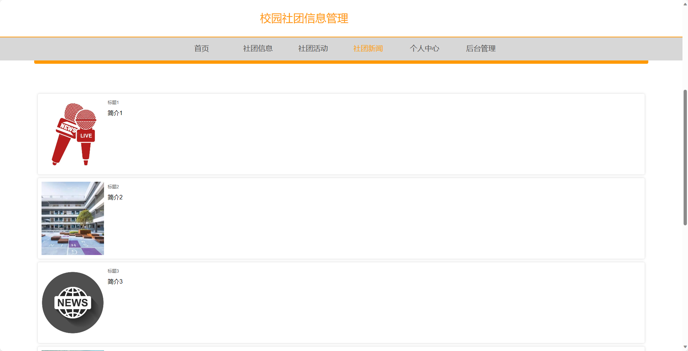
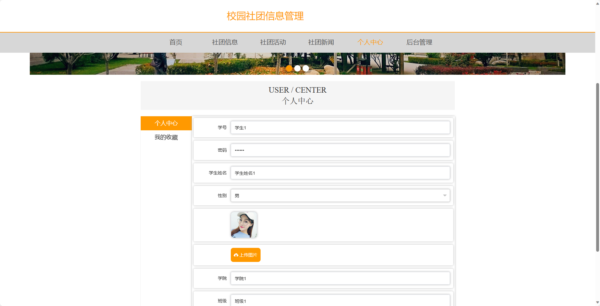
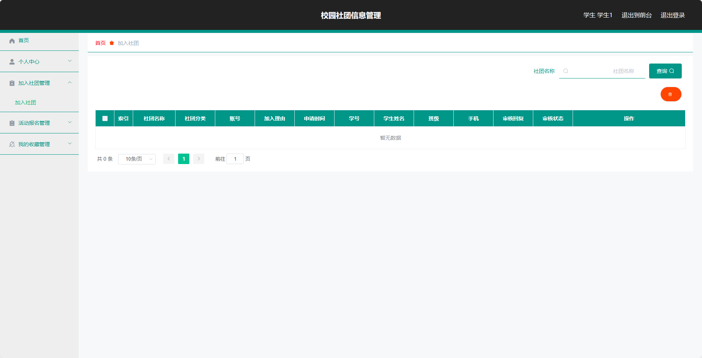
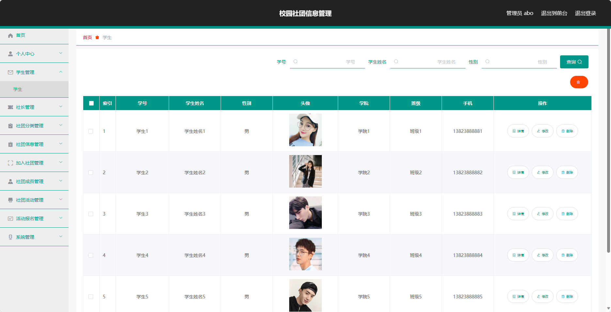
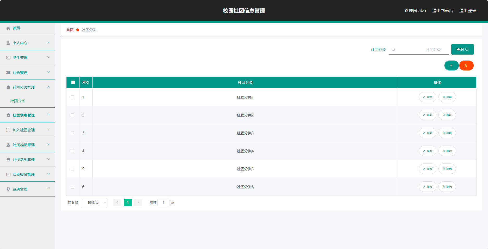
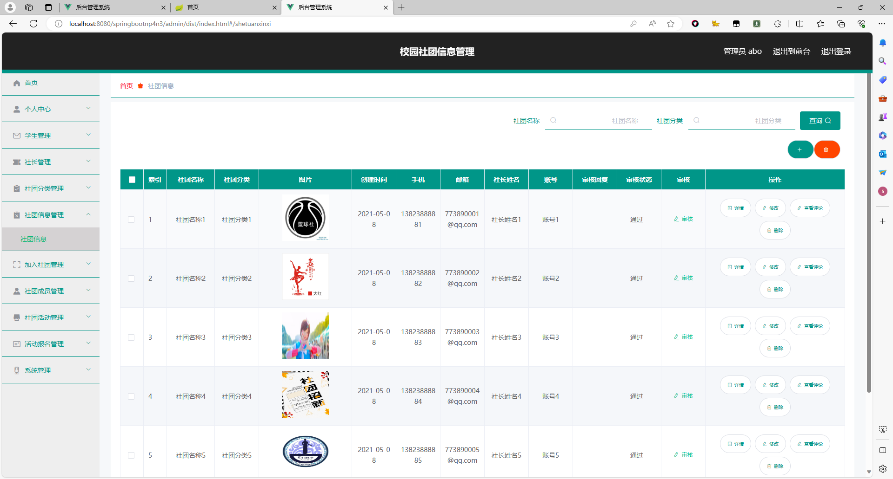

## 基于SpringBoot的校园社团信息管理(程序+报告)

- <b>完整代码获取地址：从戎源码网 ([https://armycodes.com/](https://armycodes.com/))</b>
- <b>技术探讨、资料分享，请加QQ群：692619798</b> 
- <b>作者微信：19941326836  QQ：952045282</b> 
- <b>承接计算机毕业设计、Java毕业设计、Python毕业设计、深度学习、机器学习</b>
- <b>选题+开题报告+任务书+程序定制+安装调试+论文+答辩ppt 一条龙服务</b>
- <b>所有选题地址 ([https://github.com/YuLin-Coder/AllProjectCatalog](https://github.com/YuLin-Coder/AllProjectCatalog)) </b>

## 项目介绍
基于SpringBoot的校园社团信息管理，系统包含两种角色：管理员、社长、用户,系统分为前台和后台两大模块，主要功能如下。

### 【管理员】:
- 个人中心：管理个人信息。
- 学生管理：管理学生信息。
- 社长管理：管理社长信息。
- 社团分类管理：管理社团分类信息。
- 社团信息管理：管理社团信息。
- 加入社团管理：管理学生的加入社团申请。
- 社团成员管理：管理社团的成员信息。
- 社团活动管理：管理社团的活动信息。
- 活动报名管理：管理活动的报名信息。
- 系统管理：管理系统的基本设置。

### 【前台】:
- 首页：展示系统概览信息和公告通知。
- 社团信息：查看、搜索和浏览社团信息。
- 社团活动：查看、报名和参与社团活动。
- 社团新闻：浏览社团相关的新闻资讯。
- 个人中心：管理个人信息。

### 社长：
- 个人中心：管理个人信息。
- 社团信息管理：管理所负责的社团信息。
- 加入社团管理：管理学生的加入社团申请。
- 社团成员管理：管理社团的成员信息。
- 社团活动管理：管理社团的活动信息。
- 活动报名管理：管理活动的报名信息。

### 学生：
- 个人中心：管理个人信息。
- 加入社团管理：申请加入社团。
- 活动报名管理：报名参加社团活动。
- 我的收藏管理：管理个人收藏信息。

## 项目技术
- 编程语言：Java
- 数据库：MySQL
- 项目管理工具：Maven
- 前端技术：HTML、CSS、JavaScript、Jquery、Vue
- 后端技术：Spring、SpringMVC、MyBatis

## 运行环境
- JDK版本：JDK1.8及以上
- 开发工具：IDEA、Ecplise、Myecplise都可以
- 数据库: MySQL5.7及以上
- Maven：maven3.0及以上
- Node：14.14.0及以上

## 运行截图

